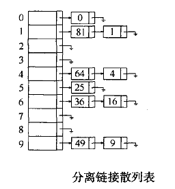

# 分离链接散列

### 散列

项的值和项的地址存在一个对应关系，这个对应关系就是散列算法。

不相同的值映射到相同的地址，这种情形称为碰撞。

散列的地址空间很大而项很少，这种情形称为浪费。

基于项的值构造一个正整数hashCode，并将hashCode%TableSize作为项的地址，可知地址∈\[0, TableSize-1\]。举两个例子：5%2=1，2%5=2。

关于TableSize的取值和散列算法的选取，要具体情况具体分析。

### 分离链接散列

用1个基于Java变长数组的表作为一级表来存储二级表的头节点，用N个基于Java LinkedList的表作为二级表来存储项，其中N为数组容量。分离链接散列消除碰撞的办法是将碰撞项存储到二级表中。



### 基于Java变长数组和Java LinkedList的分离链接散列

```java
import java.util.LinkedList;
import java.util.List;

// SeparateChaining Hash table class
//
// CONSTRUCTION: an approximate initial size or default of 101
//
// ******************PUBLIC OPERATIONS*********************
// void insert( x )       --> Insert x
// void remove( x )       --> Remove x
// boolean contains( x )  --> Return true if x is present
// void makeEmpty( )      --> Remove all items

/**
 * Separate chaining table implementation of hash tables.
 * Note that all "matching" is based on the equals method.
 * @author Mark Allen Weiss
 */
public class SeparateChainingHashTable<AnyType>
{
    /**
     * Construct the hash table.
     */
    public SeparateChainingHashTable( )
    {
        this( DEFAULT_TABLE_SIZE );
    }

    /**
     * Construct the hash table.
     * @param size approximate table size.
     */
    public SeparateChainingHashTable( int size )
    {
        theLists = new LinkedList[ nextPrime( size ) ];
        for( int i = 0; i < theLists.length; i++ )
            theLists[ i ] = new LinkedList<>( );
    }

    /**
     * Insert into the hash table. If the item is
     * already present, then do nothing.
     * @param x the item to insert.
     */
    public void insert( AnyType x )
    {
        List<AnyType> whichList = theLists[ myhash( x ) ];
        if( !whichList.contains( x ) )
        {
            whichList.add( x );

                // Rehash; see Section 5.5
            if( ++currentSize > theLists.length )
                rehash( );
        }
    }

    /**
     * Remove from the hash table.
     * @param x the item to remove.
     */
    public void remove( AnyType x )
    {
        List<AnyType> whichList = theLists[ myhash( x ) ];
        if( whichList.contains( x ) )
    {
        whichList.remove( x );
            currentSize--;
    }
    }

    /**
     * Find an item in the hash table.
     * @param x the item to search for.
     * @return true if x isnot found.
     */
    public boolean contains( AnyType x )
    {
        List<AnyType> whichList = theLists[ myhash( x ) ];
        return whichList.contains( x );
    }

    /**
     * Make the hash table logically empty.
     */
    public void makeEmpty( )
    {
        for( int i = 0; i < theLists.length; i++ )
            theLists[ i ].clear( );
        currentSize = 0;    
    }

    /**
     * A hash routine for String objects.
     * @param key the String to hash.
     * @param tableSize the size of the hash table.
     * @return the hash value.
     */
    public static int hash( String key, int tableSize )
    {
        int hashVal = 0;

        for( int i = 0; i < key.length( ); i++ )
            hashVal = 37 * hashVal + key.charAt( i );

        hashVal %= tableSize;
        if( hashVal < 0 )
            hashVal += tableSize;

        return hashVal;
    }

    private void rehash( )
    {
        List<AnyType> [ ]  oldLists = theLists;

            // Create new double-sized, empty table
        theLists = new List[ nextPrime( 2 * theLists.length ) ];
        for( int j = 0; j < theLists.length; j++ )
            theLists[ j ] = new LinkedList<>( );

            // Copy table over
        currentSize = 0;
        for( List<AnyType> list : oldLists )
            for( AnyType item : list )
                insert( item );
    }

    private int myhash( AnyType x )
    {
        int hashVal = x.hashCode( );

        hashVal %= theLists.length;
        if( hashVal < 0 )
            hashVal += theLists.length;

        return hashVal;
    }
    
    private static final int DEFAULT_TABLE_SIZE = 101;

        /** The array of Lists. */
    private List<AnyType> [ ] theLists; 
    private int currentSize;

    /**
     * Internal method to find a prime number at least as large as n.
     * @param n the starting number (must be positive).
     * @return a prime number larger than or equal to n.
     */
    private static int nextPrime( int n )
    {
        if( n % 2 == 0 )
            n++;

        for( ; !isPrime( n ); n += 2 )
            ;

        return n;
    }

    /**
     * Internal method to test if a number is prime.
     * Not an efficient algorithm.
     * @param n the number to test.
     * @return the result of the test.
     */
    private static boolean isPrime( int n )
    {
        if( n == 2 || n == 3 )
            return true;

        if( n == 1 || n % 2 == 0 )
            return false;

        for( int i = 3; i * i <= n; i += 2 )
            if( n % i == 0 )
                return false;

        return true;
    }


        // Simple main
    public static void main( String [ ] args )
    {
        SeparateChainingHashTable<Integer> H = new SeparateChainingHashTable<>( );

        long startTime = System.currentTimeMillis( );
        
        final int NUMS = 2000000;
        final int GAP  =   37;

        System.out.println( "Checking... (no more output means success)" );

        for( int i = GAP; i != 0; i = ( i + GAP ) % NUMS )
            H.insert( i );
        for( int i = 1; i < NUMS; i+= 2 )
            H.remove( i );

        for( int i = 2; i < NUMS; i+=2 )
            if( !H.contains( i ) )
                System.out.println( "Find fails " + i );

        for( int i = 1; i < NUMS; i+=2 )
        {
            if( H.contains( i ) )
                System.out.println( "OOPS!!! " +  i  );
        }
        
        long endTime = System.currentTimeMillis( );
        
        System.out.println( "Elapsed time: " + (endTime - startTime) );
    }

}
```
