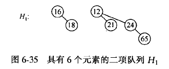
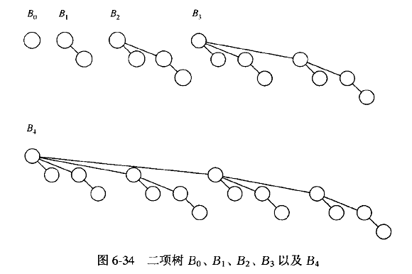

# 二项堆

### 二项堆

第一，二项堆是二项树的森林，二项堆中的二项树高度各异，第二，二项堆中任意节点的值小于这个节点的儿的值。



一个B<sub>0</sub>只有一个节点；一个B<sub>1</sub>由两个B<sub>0</sub>组成，且一个B<sub>0</sub>连接到另一个B<sub>0</sub>的根节点上；一个B<sub>2</sub>由两个B<sub>1</sub>组成，且一个B<sub>1</sub>连接到另一个B<sub>1</sub>的根节点上；……；一个B<sub>k</sub>由两个B<sub>k-1</sub>组成，且一个B<sub>k-1</sub>连接到另一个B<sub>k-1</sub>的根节点上。这样的树称为二项树。



### 基于Java子弟黏合的二项堆

```java
// BinomialHeap class
//
// CONSTRUCTION: with no parameters or a single item
//
// ******************PUBLIC OPERATIONS*********************
// void insert( x )       --> Insert x
// Comparable deleteMin( )--> Return and remove smallest item
// Comparable findMin( )  --> Return smallest item
// boolean isEmpty( )     --> Return true if empty; else false
// void makeEmpty( )      --> Remove all items
// vod merge( rhs )       --> Absord rhs into this heap
// ******************ERRORS********************************
// Throws UnderflowException as appropriate

/**
 * Implements a binomial heap.
 * Note that all "matching" is based on the compareTo method.
 * @author Mark Allen Weiss
 */
public final class BinomialHeap<AnyType extends Comparable<? super AnyType>>
{
    /**
     * Construct the binomial heap.
     */
    public BinomialHeap( )
    {
        theTrees = new BinNode[ DEFAULT_TREES ];
        makeEmpty( );
    }

    /**
     * Construct with a single item.
     */
    public BinomialHeap( AnyType item ) 
    {
        currentSize = 1;
        theTrees = new BinNode[ 1 ];
        theTrees[ 0 ] = new BinNode<>( item, null, null );
    }


    private void expandTheTrees( int newNumTrees )
    {
        BinNode<AnyType> [ ] old = theTrees;
        int oldNumTrees = theTrees.length;

        theTrees = new BinNode[ newNumTrees ];
        for( int i = 0; i < Math.min( oldNumTrees, newNumTrees ); i++ )
            theTrees[ i ] = old[ i ];
        for( int i = oldNumTrees; i < newNumTrees; i++ )
            theTrees[ i ] = null;
    }
    
    /**
     * Merge rhs into the priority queue.
     * rhs becomes empty. rhs must be different from this.
     * @param rhs the other binomial heap.
     */
    public void merge( BinomialHeap<AnyType> rhs )
    {
        if( this == rhs )    // Avoid aliasing problems
            return;

        currentSize += rhs.currentSize;
        
        if( currentSize > capacity( ) )
        {
            int newNumTrees = Math.max( theTrees.length, rhs.theTrees.length ) + 1;
            expandTheTrees( newNumTrees );
        }

        BinNode<AnyType> carry = null;
        for( int i = 0, j = 1; j <= currentSize; i++, j *= 2 )
        {
            BinNode<AnyType> t1 = theTrees[ i ];
            BinNode<AnyType> t2 = i < rhs.theTrees.length ? rhs.theTrees[ i ] : null;

            int whichCase = t1 == null ? 0 : 1;
            whichCase += t2 == null ? 0 : 2;
            whichCase += carry == null ? 0 : 4;

            switch( whichCase )
            {
              case 0: /* No trees */
              case 1: /* Only this */
                break;
              case 2: /* Only rhs */
                theTrees[ i ] = t2;
                rhs.theTrees[ i ] = null;
                break;
              case 4: /* Only carry */
                theTrees[ i ] = carry;
                carry = null;
                break;
              case 3: /* this and rhs */
                carry = combineTrees( t1, t2 );
                theTrees[ i ] = rhs.theTrees[ i ] = null;
                break;
              case 5: /* this and carry */
                carry = combineTrees( t1, carry );
                theTrees[ i ] = null;
                break;
              case 6: /* rhs and carry */
                carry = combineTrees( t2, carry );
                rhs.theTrees[ i ] = null;
                break;
              case 7: /* All three */
                theTrees[ i ] = carry;
                carry = combineTrees( t1, t2 );
                rhs.theTrees[ i ] = null;
                break;
            }
        }

        for( int k = 0; k < rhs.theTrees.length; k++ )
            rhs.theTrees[ k ] = null;
        rhs.currentSize = 0;
    }        

    /**
     * Return the result of merging equal-sized t1 and t2.
     */
    private BinNode<AnyType> combineTrees( BinNode<AnyType> t1, BinNode<AnyType> t2 )
    {
        if( t1.element.compareTo( t2.element ) > 0 )
            return combineTrees( t2, t1 );
        t2.nextSibling = t1.leftChild;
        t1.leftChild = t2;
        return t1;
    }

    /**
     * Insert into the priority queue, maintaining heap order.
     * This implementation is not optimized for O(1) performance.
     * @param x the item to insert.
     */
    public void insert( AnyType x )
    {
        merge( new BinomialHeap<>( x ) );
    }

    /**
     * Find the smallest item in the priority queue.
     * @return the smallest item, or throw UnderflowException if empty.
     */
    public AnyType findMin( )
    {
        if( isEmpty( ) )
            throw new UnderflowException( );

        return theTrees[ findMinIndex( ) ].element;
    }


    /**
     * Find index of tree containing the smallest item in the priority queue.
     * The priority queue must not be empty.
     * @return the index of tree containing the smallest item.
     */
    private int findMinIndex( )
    {
        int i;
        int minIndex;

        for( i = 0; theTrees[ i ] == null; i++ )
            ;

        for( minIndex = i; i < theTrees.length; i++ )
            if( theTrees[ i ] != null &&
                theTrees[ i ].element.compareTo( theTrees[ minIndex ].element ) < 0 )
                minIndex = i;

        return minIndex;
    }

    /**
     * Remove the smallest item from the priority queue.
     * @return the smallest item, or throw UnderflowException if empty.
     */
    public AnyType deleteMin( )
    {
        if( isEmpty( ) )
            throw new UnderflowException( );

        int minIndex = findMinIndex( );
        AnyType minItem = theTrees[ minIndex ].element;

        BinNode<AnyType> deletedTree = theTrees[ minIndex ].leftChild;

        // Construct H''
        BinomialHeap<AnyType> deletedHeap = new BinomialHeap<>( );
        deletedHeap.expandTheTrees( minIndex );
        
        deletedHeap.currentSize = ( 1 << minIndex ) - 1;
        for( int j = minIndex - 1; j >= 0; j-- )
        {
            deletedHeap.theTrees[ j ] = deletedTree;
            deletedTree = deletedTree.nextSibling;
            deletedHeap.theTrees[ j ].nextSibling = null;
        }

        // Construct H'
        theTrees[ minIndex ] = null;
        currentSize -= deletedHeap.currentSize + 1;

        merge( deletedHeap );
        
        return minItem;
    }

    /**
     * Test if the priority queue is logically empty.
     * @return true if empty, false otherwise.
     */
    public boolean isEmpty( )
    {
        return currentSize == 0;
    }

    /**
     * Make the priority queue logically empty.
     */
    public void makeEmpty( )
    {
        currentSize = 0;
        for( int i = 0; i < theTrees.length; i++ )
            theTrees[ i ] = null;
    }

    private static class BinNode<AnyType>
    {
            // Constructors
        BinNode( AnyType theElement )
        {
            this( theElement, null, null );
        }

        BinNode( AnyType theElement, BinNode<AnyType> lt, BinNode<AnyType> nt )
        {
            element     = theElement;
            leftChild   = lt;
            nextSibling = nt;
        }

        AnyType          element;     // The data in the node
        BinNode<AnyType> leftChild;   // Left child
        BinNode<AnyType> nextSibling; // Right child
    }

    private static final int DEFAULT_TREES = 1;

    private int currentSize;                // # items in priority queue
    private BinNode<AnyType> [ ] theTrees;  // An array of tree roots


    /**
     * Return the capacity.
     */
    private int capacity( )
    {
        return ( 1 << theTrees.length ) - 1;
    }

    public static void main( String [ ] args )
    {
        int numItems = 10000;
        BinomialHeap<Integer> h  = new BinomialHeap<>( );
        BinomialHeap<Integer> h1 = new BinomialHeap<>( );
        int i = 37;

        System.out.println( "Starting check." );

        for( i = 37; i != 0; i = ( i + 37 ) % numItems )
            if( i % 2 == 0 )
                h1.insert( i );
            else
                h.insert( i );

        h.merge( h1 );
        for( i = 1; i < numItems; i++ )
            if( h.deleteMin( ) != i )
                System.out.println( "Oops! " + i );
 
        System.out.println( "Check done." );
    }
}
```

### UnderflowException类

```java
/**
 * Exception class for access in empty containers
 * such as stacks, queues, and priority queues.
 * @author Mark Allen Weiss
 */
public class UnderflowException extends RuntimeException
{
}
```


