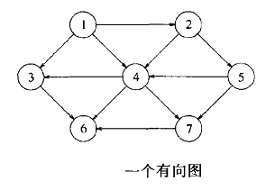

# 网

### 网

网中有点。有些点之间有边，有些点之间没有边。同时，有些边是双向的，代表两个点之间能够双向联系，有些边是单向的，代表两个点之间能够单向联系。

点x能联系到点y，说明从点x到点y存在路径，但是不能说明从点y到点x存在路径。

点x能联系到点y且点x和点y之间只存在一条边，说明点y是点x的一个邻接点，但是不能说明点x是点y的一个邻接点。

### 基于Java Map和Java List的网

使用一个Java Map，点的名称作为key，Vertex对象作为value，Vertex对象中保存关于这个点的信息，其中重要的信息之一是这个点的邻接表，邻接表基于Java List。
